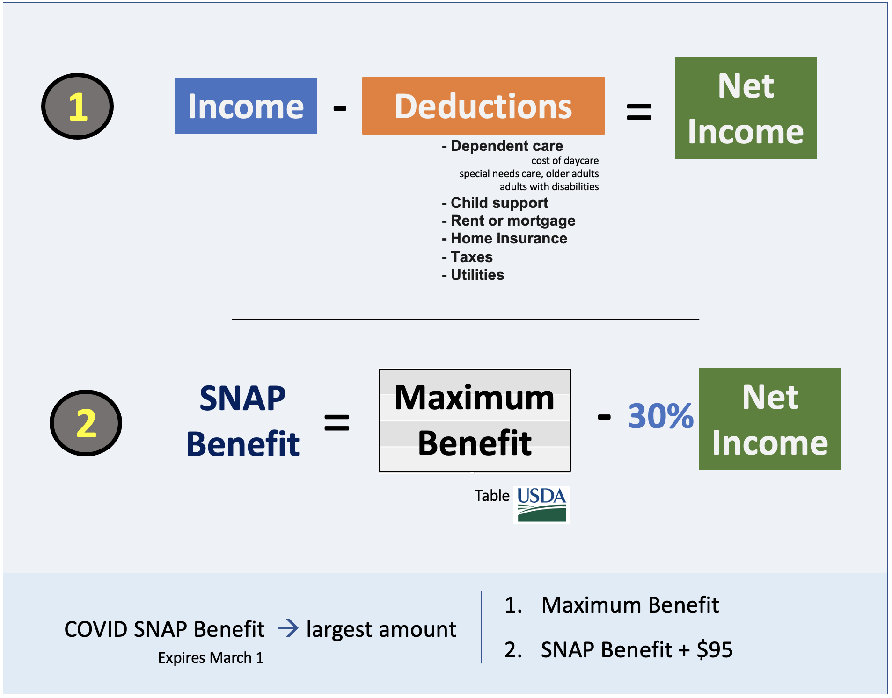

 


<div style="margin: auto; width: 100%; text-align: center; border: 2px solid white;">
<h4><strong>Methodology Summary </strong></h4>
</div>



<br>
<br>


## What Factors Contribute to SNAP Benefit Estimations?

SNAP eligibility and benefit rules are largely the same across all states except for changes in BBCE and deductible amounts to calculate net income (see specifics for VA, MD, and DC below)   
[Virginia](https://www.snapscreener.com/guides/virginia)  
[Maryland](https://www.snapscreener.com/guides/maryland)  
[District of Columbia](https://www.snapscreener.com/guides/district-of-columbia)  

VA, MD, and DC  all deduct for dependent care, monthly rent/mortgage, and homeowners insurance and taxes. They only differ in terms of utility and phone allowance deductions.   

<br>

### SNAP Benefit Calculation Approach

In order to calculate estimated SNAP benefit and other statistics shown in the data dictionary below, we follow the methodology used in the [Virginia SNAP Prescreener](https://www.snapscreener.com/screener?state=VA). 


1. We first use a household's monthly income as their **gross monthly income**. 

2. We then calculate the **net income** by subtracting deductions from the gross monthly income.  
  -In our calculations using the data we have available, we include household size, income, dependent care, and rent as potential deductibles.  
  -Additionally, we assume that the household uses heating and water utilities, which they receive deductions for.

Once we have the gross and net monthly incomes, we calculate the estimated SNAP and COVID-SNAP benefits from the maximum and minimum allotments per household size.

3. We check that gross income is below the income limit for the given household size.  
  -if this is the case then we subtract 30% of the net income from the max allotment for the given household size to get our estimated SNAP benefit.  

4. For COVID-SNAP benefit, we take the maximum of the max allotment and the estimated SNAP benefit + 95, setting the value to whichever is greater. We then use both of these estimated benefits in plots and explorations. 

*Our results from the calculations have been cross-referenced with those from the snapscreener website to ensure their validity. For more detailed information on the benefit calculation process, please use the snapscreener link above.*   


<br>
<br>

### Data Dictionary

| Variable | Description |
| -------- | ----------- |
| geoid | The geographic label for a Fairfax Census Tract |
| NAME | The full name of a Fairfax Census Tract as collected in census data |
| Mean monthly income | The average monthly income per household in a given tract (dollars) |
| Mean monthly COVID benefit | The average monthly SNAP benefit amount received by a household during COVID crisis rules (dollars) |
| Mean monthly SNAP benefit | The average monthly SNAP benefit amount received by a household after new policy implementation (dollars) |
| Mean Benefit Loss | The difference between Monthly mean COVID benefit and Monthly mean SNAP benefit that a household loses after new policy implementation (dollars) |
| SNAP Eligibility Proportion | The proportion of households within a given tract that receive above $0 in predicted SNAP benefits |
| Income Category | The nine different income categories that a household's yearly income can fall in |
| Average Household Size | The average number of people residing in a household in a given tract |
| Households Represented | The amount of households that the statistics for a given tract represent |
| People Represented | Households Represented divided by Average Household Size: this produces an estimate for the people represented within a tract or income category |

<br>

## Exploratory Plots

```{r, echo=FALSE, warning=FALSE, include=FALSE}
library(tidyverse)
library(acs)
library(tidycensus)
library(tigris)
library(plotly)
library(shiny)
library(ggplot2)
library(viridis)

weights_geo <- read.csv("img/weights_geo.csv")

geo_census <- get_acs(geography = "tract",
                                  year = 2020,
                                  variables = c(Total = "B22003_001"
                                  ),
                                  state = 51, # VA
                                  county = 059,
                                  survey = "acs5",
                                  geometry = TRUE)

geo_census$GEOID <- as.numeric(geo_census$GEOID)
fairfax <- geo_census[, c(1, 2, 6)]

weights_geo <- weights_geo %>% left_join(fairfax, by = c("geoid"="GEOID"))

#View(weights_geo_inc)
```

```{r, echo=FALSE}
gg_benefit_eligibility <- ggplot(weights_geo, aes(x=SNAP_eligibility_proportion, y=monthly_mean_SNAP_benefit, label = NAME, label2 = households_represented, label3 = average_hh_size)) + geom_point(color="#232D4B") + labs(title = "SNAP Eligibility Proportion vs Monthly Mean SNAP Benefit", y = "Monthly Mean SNAP Benefit", x = "SNAP Eligibility Proportion")
ggplotly(gg_benefit_eligibility)
```
