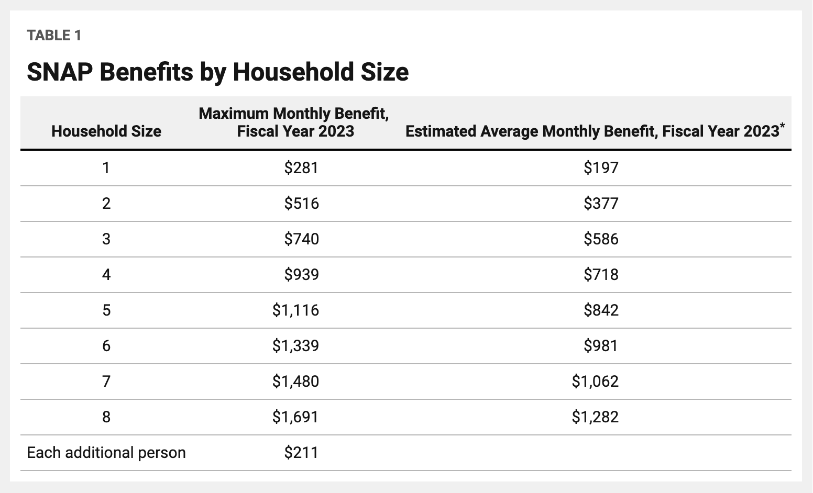

## What is SNAP?

The Supplemental Nutrition Assistance Program (SNAP) is the largest federal nutrition assistance program.  Formerly known as Food Stamps, SNAP helps families to afford a basic diet. 

Participants may use SNAP benefits in supermarkets, grocery stores, convenience stores and food retailers to purchase food.

 

</table>
<tr>
    <h3>Nationwide Numbers of the SNAP - 2022: </h3>
<h4>
- People Participating (thousands):	41,207  
- Households Participating (thousands):	21,612  
- Value of Benefits (million dollars):	113,738  
- Average Monthly Benefit Per Person (dollars):	230.01  
- Average Monthly Benefit Per Household (dollars):	438.56  
- *Total Cost (million dollars):	119,242  

</h4>
<tr>
</table>

*Total cost includes benefits, administrative expenses, and other cost, for example, printing and processing stamps. 

 

## Eligibility

[General Overview of SNAP Rules](https://www.cbpp.org/research/food-assistance/a-quick-guide-to-snap-eligibility-and-benefits)

SNAP is 100% federally funded but administrative costs are shared evenly between the states and the USDA. Counties will occasionally supplement SNAP funding as well. SNAP is county-administered specifically in Virginia.

Under federal rules, to be eligible for benefits a household’s income and resources must meet *three tests*:  

1. **Gross monthly income** - household income before any of the program’s deductions are applied — generally must be at or below 130 percent of the poverty line. The poverty level is higher for larger families and lower for smaller families.  
2. **Net income** - household income after deductions are applied must be at or below the poverty line.  
3. **Assets** must fall below certain limits: households without a member who is age 60 or older or who has a disability must have assets of \$2,750 or less and households with such a member must have assets of \$4,250 or less.  

For more information see [USDA SNAP Eligibility](https://www.fns.usda.gov/snap/recipient/eligibility).  

 

## Broad-Based Categorical Eligibility

*Broad-based categorical eligibility (BBCE)* raises the gross income limit from the current standard of 130 percent of the federal poverty level by allowing states to consider cost of living, wages, and other local economic conditions when determining people's eligibility for the SNAP. For example, in Virginia, Maryland, and the District of Columbia **the income limit is 200% of the poverty level and there are no asset limits.**  

Resources for Broad-Based Categorical Eligibility:  
[General Overview of Broad-Based Categorical Eligibility](https://www.cbpp.org/research/food-assistance/snaps-broad-based-categorical-eligibility-supports-working-families-and)  
[Eligibility Rules for Different States](https://www.fns.usda.gov/snap/broad-based-categorical-eligibility)  

 

## SNAP Benefit Rules

All states have the same Maximum Monthly Benefit for the fiscal year of 2023, differing by household size (thresholds shown below).

  

 

## SNAP During COVID  

During the early months of the pandemic, June through September 2020, the average monthly SNAP participation increased by over 2.6 million households. In these households, there was a larger share of households with no earned income, an increase from the pre-pandemic period by almost 3 percent points.^1^

This food insecurity crisis was characterized by a large array of governmental and non-governmental efforts to mitigate the impact of the pandemic. Beginning in March 2020, USDA approved states to provide SNAP households with extra pandemic-related SNAP benefits known as emergency allotments (EA). There were a variety of state and federal changes that impacted SNAP benefit amounts. For example, Congress acted in December 2020 to raise SNAP maximum benefits by 15 percent from January through June 2021 and to boost every household to the maximum benefit for their household size.^2^ By law, the EA benefits ended for all states and the District of Columbia at the end of February 2023. 18 states chose to end EA benefits prior to this date some as early as March 2021^3^, but for SNAP participants in the National Capitol Region the EA benefits ended at the end of February 2023.

Separate from the pandemic response, on October 1, 2022, the maximum SNAP benefits, which are tied to food inflation at the national level, automatically increased by 12.5 percent.^4^ In addition to the benefit increase, changes were made to the cash limits, the limit for households increased by \$250 to \$2,750 and the resource limit for households where at least one person is age 60 or older, or is disabled, increased by \$500 to \$4,250.

This SNAP dashboard evaluates the effect of these policy changes.

 

**References**

^1^ [USDA Food and Nutrition Service Research Brief (November 2022). Early Months of the COVID-19 Pandemic in Fiscal Year 2020: Characteristics of Supplemental Nutrition Assistance Program Households.](https://fns-prod.azureedge.us/sites/default/files/resource-files/Characteristics2020-COVID-19-Companion.pdf)

^2^ [USDA Food and Nutrition Service Research Brief, SNAP Benefits - COVID-19 Pandemic and Beyond (10/08/2021).](https://www.fns.usda.gov/snap/benefit-changes-2021#:~:text=Breadcrumb&text=In%20response%20to%20the%20pandemic,benefit%20for%20their%20household%20size)

^3^ [USDA Food and Nutrition Service, Recent Changes to SNAP Benefit Amounts (02/27/2023).](https://www.fns.usda.gov/snap/2023-benefit-changes)

^4^ [USDA Food and Nutrition Service Research, SNAP – Fiscal Year 2023 Cost-of-Living Adjustments (August 9, 2022):](https://fns-prod.azureedge.us/sites/default/files/resource-files/snap-fy-2023-cola-adjustments.pdf)

 

## New Policy Change for Emergency Benefits

On **March 1st** people residing in Maryland, Virginia, and Washington D.C. will no longer receive the emergency SNAP allotment that was available during the COVID pandemic. These emergency benefits allowed any SNAP-eligible person to receive either the maximum possible allotment (shown in the table above), or their predicted benefit + $95. We aim to examine the effects of this policy change, as there are people in need who [face rising costs and will receive less money for food](https://wjla.com/news/local/dc-snap-recipients-face-lingering-high-costs-as-emergency-benefits-end-march-1-emergency-allotment-washington-maryland-virginia-capital-area-food-bank-assistance-money-inflation-hunger-economy#)